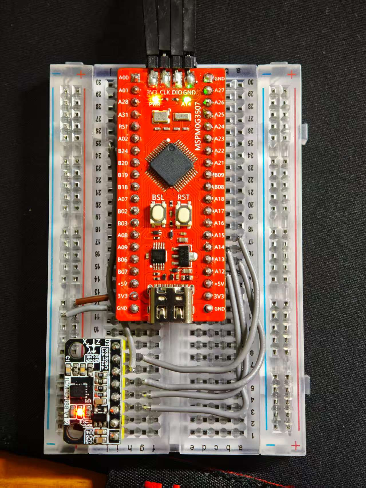
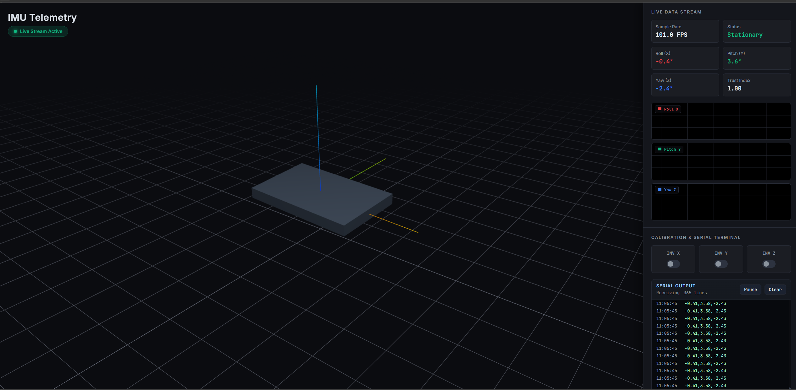

# ICM42688 6轴姿态解算与可视化系统 (MSPM0G3507)

这是一个基于 **TI MSPM0G3507** 单片机和 **ICM42688** IMU 的高性能姿态解算项目。项目实现了硬件 FIFO 数据读取、Mahony 姿态滤波，并通过 Python + WebSocket 构建了一个企业级的 Web 远程可视化仪表盘。

------

## 📸 项目演示

| **硬件实拍**                         | **可视化仪表盘**                                            |
| ------------------------------------ | ----------------------------------------------------------- |
|  |  |
| *MSPM0G3507 与 ICM42688 硬件连接*    | *实时欧拉角、3D 姿态模型、FPS 指标*                         |

------

## ✨ 核心特性

- **高性能姿态解算**：集成 Mahony 互补滤波算法，针对 Cortex-M0 内核优化了快速平方根倒数运算。
- **企业级仪表盘**：
  - **3D 实时模型**：使用 Three.js 实现传感器姿态的 3D 同步显示。
  - **动态图表**：实时绘制 Roll/Pitch/Yaw 的 SmoothieCharts 历史趋势图。
  - **远程终端**：Web 端内置串口打印日志查看器，支持数据波形解析验证。
- **鲁棒性设计**：包含硬件错误 (HardFault) 防护逻辑、动态 $K_p$ 调整以及零速更新 (ZUPT) 预留。

------

## 📂 文件组织结构

Plaintext

```
C:.
│  README.md
├─imu_dashboard            # 可视化仪表盘后端与前端
│      imu_dashboard.html  # 基于 Three.js 的 Web 前端仪表盘
│      imu_dashboard.py    # Python 后端：负责串口解析、WS 服务与 HTTP 服务
└─mspm0                    # MSPM0G3507 单片机工程代码 (Keil MDK)
    ├─BSP                  # 基础外设驱动 (Delay, UART)
    ├─DRIVER               # ICM42688 SPI 协议层驱动
    ├─HARDWARE             # 核心组件：ICM42688 逻辑、Mahony 算法、寄存器定义
    └─keil                 # Keil 工程文件、SysConfig 配置及编译生成文件
```

------

## 🛠️ 快速上手

### 1. 硬件连接

| **ICM42688 引脚** | **MSPM0 引脚** | **描述**          |
| ----------------- | -------------- | ----------------- |
| VCC/GND           | 3.3V/GND       | 电源 (注意电压)   |
| SCLK              | PA13           | SPI 时钟          |
| PICO (SDI)        | PA12           | SPI 数据输入      |
| POCI (SDO)        | PA11           | SPI 数据输出      |
| CS                | PA10           | 片选 (Active Low) |
| INT1              | PA15           | 硬件中断输入      |

### 2. 单片机端 (Keil MDK)

1. 打开 `mspm0/keil/empty_LP_MSPM0G3507_nortos_keil.uvprojx`。
2. 使用 **SysConfig** 工具确认时钟和引脚配置。
3. 编译并烧录至 MSPM0G3507 核心板。

### 3. 可视化仪表盘 (Python)

确保你的电脑已安装 Python 3.8+，然后安装依赖：

Bash

```
pip install pyserial numpy websockets
```

运行后端程序（请根据实际情况修改 `imu_dashboard.py` 中的 `SERIAL_PORT`）：

Bash

```
cd imu_dashboard
python imu_dashboard.py
```

程序会自动打开浏览器并跳转至 `http://localhost:8000/imu_dashboard.html`。

------

## ⚙️ 算法参数说明

在 `mahony_ahrs.c` 中，你可以根据实际需求调整：

- **$K_p$**: 决定加速度计修正姿态的权重。默认 `0.5f`。
- **$K_i$**: 决定消除陀螺仪静态零偏的速度。默认 `0.005f`。
- **ODR**: 默认采样频率为 `100Hz`，配合硬件 FIFO 减少 CPU 负荷。

------

## 📜 许可证

本项目遵循 [MIT License](https://www.google.com/search?q=LICENSE&authuser=1) 开源许可。

------

## 👨‍💻 作者与鸣谢

- **Author**: kjmsd
- **Algorithms**: Mahony AHRS
- **Tools**: TI SysConfig, Keil MDK, Three.js, SmoothieCharts

